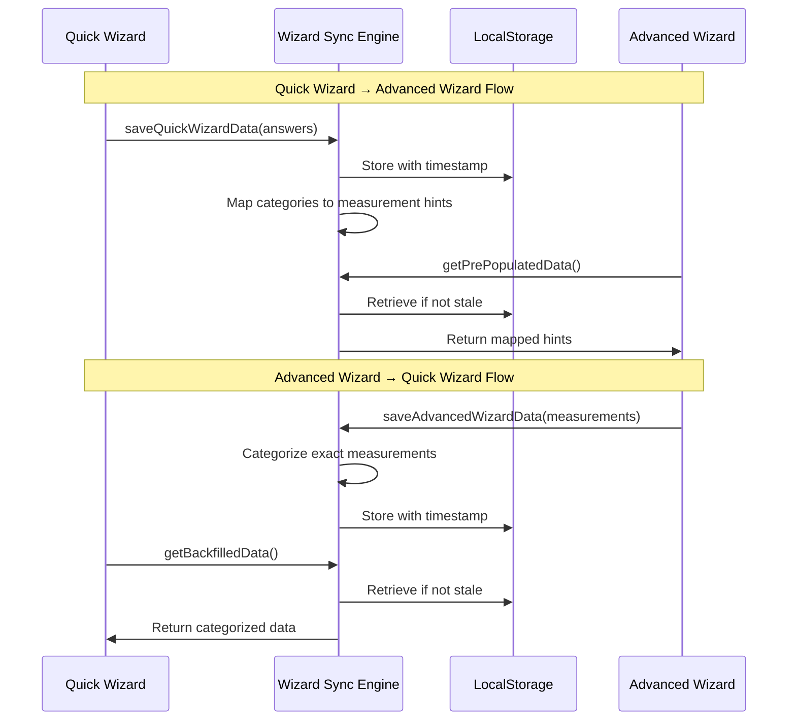
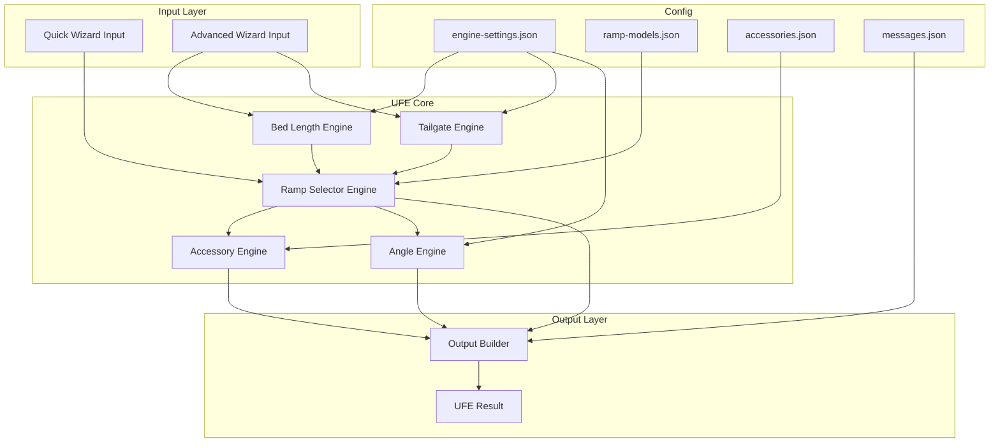

# Unified Fitment Engine (UFE) - Implementation Plan

**Version:** 1.0
**Date:** December 11, 2024
**Status:** Awaiting Approval

---

## 1. Executive Summary

This plan details the implementation of the **Unified Fitment Engine (UFE)** - a config-driven, modular TypeScript system that powers two fitment wizards for EZ Cycle Ramp:

1. **Quick Wizard** - Fast 5-7 question flow for rapid ramp recommendation
2. **Advanced Wizard** - Detailed measurement-based configurator for complete quotes with accessories

The UFE will be implemented as a standalone module (`src/lib/ufe/`) with clean integration into the existing Next.js application.

---

## 2. Authoritative Business Rules

### 2.1 Ramp Models

| Model | Folds? | Tailgate Close (Loaded) | Tailgate Close (Unloaded) | Compatible Accessories |
|-------|--------|-------------------------|---------------------------|------------------------|
| **AUN210** | No | Yes (if `motorcycle_length + 3" ≤ usable_bed_length`) | Yes | AC004, AC001-x |
| **AUN250** | Yes (unloaded only) | No | Yes (when folded) | 4-Beam, AC001-x |

### 2.2 Bed Length Categories

| Category | Range (inches) |
|----------|----------------|
| Short | < 72" |
| Standard | 72" - 95" |
| Long | ≥ 96" |

### 2.3 Decision Priority Order

1. Safety considerations
2. Tailgate closure requirements
3. Usable bed length calculation
4. Tonneau penalty application
5. Ramp geometry compatibility
6. Required accessories
7. Angle warnings (soft)
8. User preferences

### 2.4 Tailgate Close Logic

| Scenario | Ramp | Conditions | Accessories |
|----------|------|------------|-------------|
| Tailgate must close + motorcycle NOT loaded | AUN250 | Ramp must be folded | None required |
| Tailgate must close + motorcycle loaded | AUN210 | `motorcycle_length + 3" ≤ usable_bed_length` | AC004 required |
| Tailgate must close + motorcycle loaded | — | Condition fails | **HARD FAILURE** |

### 2.5 Accessory Rules

| Accessory | Compatible With | Required When |
|-----------|-----------------|---------------|
| **AC004** | AUN210 only | AUN210 + tailgate close with motorcycle loaded |
| **4-Beam Extension** | AUN250 only | Bed is long OR `(bed_length + tailgate_length) > 101"` |
| **AC001-1** | Both | Height 35" - 42" |
| **AC001-2** | Both | Height 43" - 51" |
| **AC001-3** | Both | Height 52" - 60" |

### 2.6 Calculations

```
usable_bed_length = bed_length - tonneau_penalty
tonneau_penalty = config.tonneauPenaltyInches (default: 10")
angle = atan(height / usable_bed_length) // Optional, toggleable
```

---

## 3. Directory Structure

```
src/lib/ufe/
├── index.ts                    # Main export/orchestrator
├── types.ts                    # All UFE TypeScript types
│
├── config/
│   ├── engine-settings.json    # Core engine configuration
│   ├── ramp-models.json        # Ramp model definitions
│   ├── accessories.json        # Accessory definitions & compatibility
│   ├── bed-categories.json     # Bed length category definitions
│   ├── messages.json           # User-facing message templates
│   └── index.ts                # Config loader & validator
│
├── engines/
│   ├── bed-length.engine.ts    # Bed length categorization & usable length calc
│   ├── tailgate.engine.ts      # Tailgate close logic & validation
│   ├── ramp-selector.engine.ts # Ramp recommendation logic
│   ├── accessory.engine.ts     # Accessory requirement determination
│   ├── angle.engine.ts         # Loading angle calculation (toggleable)
│   └── index.ts                # Engine exports
│
├── wizards/
│   ├── quick-wizard.controller.ts    # Quick Wizard state & logic
│   ├── advanced-wizard.controller.ts # Advanced Wizard state & logic
│   ├── wizard-sync.engine.ts         # Bidirectional data sync
│   └── index.ts                      # Wizard exports
│
├── utils/
│   ├── output-builder.ts       # Result formatting & message generation
│   ├── validators.ts           # Input validation utilities
│   ├── converters.ts           # Unit conversion utilities
│   └── index.ts                # Utility exports
│
├── __tests__/
│   ├── bed-length.engine.test.ts
│   ├── tailgate.engine.test.ts
│   ├── ramp-selector.engine.test.ts
│   ├── accessory.engine.test.ts
│   ├── angle.engine.test.ts
│   ├── quick-wizard.test.ts
│   ├── advanced-wizard.test.ts
│   ├── wizard-sync.test.ts
│   ├── integration.test.ts
│   └── fixtures/
│       ├── test-scenarios.json
│       └── expected-outputs.json
│
└── docs/
    ├── ARCHITECTURE.md         # Technical architecture documentation
    ├── RULES-REFERENCE.md      # Business rules quick reference
    ├── CONFIGURATION-GUIDE.md  # How to modify configs
    └── diagrams/
        ├── decision-flow.mermaid
        ├── wizard-sync.mermaid
        └── engine-architecture.mermaid
```

---

## 4. File-by-File Implementation Details

### 4.1 Configuration Files

#### `config/engine-settings.json`
```json
{
  "version": "1.0.0",
  "angleCalculation": {
    "enabled": true,
    "warningThresholdDegrees": 25,
    "maxSafeDegrees": 30
  },
  "tonneauPenaltyInches": 10,
  "beamExtensionThresholdInches": 101,
  "tailgateCloseBufferInches": 3,
  "bedLengthCategories": {
    "short": { "max": 71.99 },
    "standard": { "min": 72, "max": 95.99 },
    "long": { "min": 96 }
  },
  "unitDefaults": {
    "length": "inches",
    "weight": "lbs"
  }
}
```

#### `config/ramp-models.json`
```json
{
  "models": {
    "AUN210": {
      "name": "AUN210 Standard Ramp",
      "sku": "AUN210",
      "price": 999.00,
      "folds": false,
      "tailgateCloseLoaded": true,
      "tailgateCloseUnloaded": true,
      "compatibleAccessories": ["AC004", "AC001-1", "AC001-2", "AC001-3"],
      "incompatibleAccessories": ["4-BEAM"],
      "recommendForBedCategories": ["standard", "long"],
      "active": true
    },
    "AUN250": {
      "name": "AUN250 Folding Ramp (Premium)",
      "sku": "AUN250",
      "price": 1299.00,
      "folds": true,
      "foldsWhenLoaded": false,
      "tailgateCloseLoaded": false,
      "tailgateCloseUnloaded": true,
      "compatibleAccessories": ["4-BEAM", "AC001-1", "AC001-2", "AC001-3"],
      "incompatibleAccessories": ["AC004"],
      "recommendForBedCategories": ["short", "standard"],
      "active": true
    }
  },
  "futureModels": {
    "_comment": "Placeholder for upcoming ramp models"
  }
}
```

#### `config/accessories.json`
```json
{
  "accessories": {
    "AC004": {
      "name": "AC004 Tailgate Extension",
      "sku": "AC004",
      "price": 199.00,
      "type": "tailgate-extension",
      "compatibleRamps": ["AUN210"],
      "requiredWhen": {
        "condition": "tailgateCloseWithMotorcycleLoaded",
        "ramp": "AUN210"
      },
      "removable": true,
      "description": "Required for loading/unloading with AUN210 when tailgate must close"
    },
    "4-BEAM": {
      "name": "4-Beam Extension",
      "sku": "4-BEAM",
      "price": 249.00,
      "type": "bed-extension",
      "compatibleRamps": ["AUN250"],
      "requiredWhen": {
        "condition": "longBedOrExceedsThreshold",
        "ramp": "AUN250"
      },
      "description": "Required for AUN250 on long beds or when total length exceeds threshold"
    },
    "AC001-1": {
      "name": "AC001-1 Tailgate Height Extension",
      "sku": "AC001-1",
      "price": 149.00,
      "type": "height-extension",
      "compatibleRamps": ["AUN210", "AUN250"],
      "heightRange": { "min": 35, "max": 42 }
    },
    "AC001-2": {
      "name": "AC001-2 Tailgate Height Extension",
      "sku": "AC001-2",
      "price": 179.00,
      "type": "height-extension",
      "compatibleRamps": ["AUN210", "AUN250"],
      "heightRange": { "min": 43, "max": 51 }
    },
    "AC001-3": {
      "name": "AC001-3 Tailgate Height Extension",
      "sku": "AC001-3",
      "price": 209.00,
      "type": "height-extension",
      "compatibleRamps": ["AUN210", "AUN250"],
      "heightRange": { "min": 52, "max": 60 }
    }
  }
}
```

#### `config/messages.json`
```json
{
  "recommendations": {
    "AUN210": {
      "primary": "Based on your requirements, we recommend the AUN210 Standard Ramp.",
      "tailgateClose": "The AUN210 allows your tailgate to close with your motorcycle loaded.",
      "withAC004": "The AC004 Tailgate Extension is required for loading/unloading and can be removed after."
    },
    "AUN250": {
      "primary": "Based on your requirements, we recommend the AUN250 Folding Ramp.",
      "tailgateClose": "The AUN250 allows your tailgate to close when the ramp is folded (motorcycle unloaded).",
      "with4Beam": "The 4-Beam Extension is required for your bed configuration."
    }
  },
  "warnings": {
    "angleHigh": "Loading angle of {angle}° is higher than recommended. Use caution when loading.",
    "tonneau": {
      "rollsIntoBed": "Your roll-up cover reduces usable bed length by approximately {penalty} inches.",
      "triFold": "Fold your cover toward the cab before loading.",
      "hinged": "Open your cover fully before loading.",
      "retractable": "Ensure canister is at least 10 inches from cab."
    }
  },
  "errors": {
    "hardFailure": "Unfortunately, we cannot recommend a configuration that allows your tailgate to close with your motorcycle loaded given the measurements provided.",
    "measurementOutOfRange": "The {field} measurement of {value}\" is outside the supported range ({min}\" - {max}\")."
  }
}
```

---

### 4.2 TypeScript Types (`types.ts`)

```typescript
// Ramp model identifiers
export type RampModelId = 'AUN210' | 'AUN250';

// Accessory identifiers
export type AccessoryId = 'AC004' | '4-BEAM' | 'AC001-1' | 'AC001-2' | 'AC001-3';

// Bed length categories
export type BedCategory = 'short' | 'standard' | 'long';

// Tonneau cover types
export type TonneauType =
  | 'roll-up-soft'
  | 'roll-up-hard'
  | 'tri-fold-soft'
  | 'tri-fold-hard'
  | 'bi-fold'
  | 'hinged'
  | 'retractable'
  | 'other'
  | 'none';

// Roll direction for roll-up covers
export type RollDirection = 'on-top' | 'into-bed';

// Unit systems
export type UnitSystem = 'imperial' | 'metric';

// Recommendation result types
export type RecommendationType = 'primary' | 'alternative' | 'not-recommended';

// Failure types
export type FailureType = 'hard' | 'soft' | 'none';

// Quick Wizard Input
export interface QuickWizardInput {
  bedLength: BedCategory | 'unsure';
  hasTonneau: boolean;
  tonneauType?: TonneauType;
  rollDirection?: RollDirection;
  tailgateMustClose: boolean;
  motorcycleLoadedWhenClosed?: boolean;
}

// Advanced Wizard Input - Truck Measurements
export interface TruckMeasurements {
  bedLengthClosed: number;      // inches
  bedLengthWithTailgate: number; // inches (bed + open tailgate)
  tailgateHeight: number;        // inches (top of open tailgate from ground)
  hasTonneau: boolean;
  tonneauType?: TonneauType;
  rollDirection?: RollDirection;
}

// Advanced Wizard Input - Motorcycle Measurements
export interface MotorcycleMeasurements {
  weight: number;      // lbs
  wheelbase: number;   // inches
  totalLength: number; // inches
}

// Advanced Wizard Input
export interface AdvancedWizardInput {
  truck: TruckMeasurements;
  motorcycle: MotorcycleMeasurements;
  tailgateMustClose: boolean;
  motorcycleLoadedWhenClosed?: boolean;
  unitSystem: UnitSystem;
}

// Calculated Values
export interface CalculatedValues {
  usableBedLength: number;
  tonneauPenalty: number;
  bedCategory: BedCategory;
  loadingAngle?: number;
  tailgateCloseWithLoadPossible: boolean;
  exceeds4BeamThreshold: boolean;
}

// Accessory Requirement
export interface AccessoryRequirement {
  accessoryId: AccessoryId;
  required: boolean;
  reason: string;
  price: number;
}

// Ramp Recommendation
export interface RampRecommendation {
  rampId: RampModelId;
  type: RecommendationType;
  name: string;
  price: number;
  reasons: string[];
  warnings: string[];
  requiredAccessories: AccessoryRequirement[];
  optionalAccessories: AccessoryRequirement[];
}

// UFE Result
export interface UFEResult {
  success: boolean;
  failure?: {
    type: FailureType;
    message: string;
    details?: string;
  };
  primaryRecommendation?: RampRecommendation;
  alternativeRecommendation?: RampRecommendation;
  calculatedValues: CalculatedValues;
  tonneauNotes?: string[];
  angleWarning?: string;
  timestamp: string;
  inputHash: string; // For caching/deduplication
}

// Wizard Sync Data
export interface WizardSyncData {
  source: 'quick' | 'advanced';
  timestamp: number;
  quickWizardData?: Partial<QuickWizardInput>;
  advancedWizardData?: Partial<AdvancedWizardInput>;
  recommendation?: RampModelId;
}

// Engine Settings (loaded from config)
export interface EngineSettings {
  version: string;
  angleCalculation: {
    enabled: boolean;
    warningThresholdDegrees: number;
    maxSafeDegrees: number;
  };
  tonneauPenaltyInches: number;
  beamExtensionThresholdInches: number;
  tailgateCloseBufferInches: number;
  bedLengthCategories: {
    short: { max: number };
    standard: { min: number; max: number };
    long: { min: number };
  };
}
```

---

### 4.3 Engine Modules

#### `engines/bed-length.engine.ts`
**Purpose:** Categorize bed length and calculate usable bed length after tonneau penalty.

**Functions:**
- `categorizeBedLength(lengthInches: number): BedCategory`
- `calculateUsableBedLength(bedLength: number, tonneauPenalty: number): number`
- `determineTonneauPenalty(tonneauType: TonneauType, rollDirection?: RollDirection): number`

---

#### `engines/tailgate.engine.ts`
**Purpose:** Determine if tailgate can close under various conditions.

**Functions:**
- `canTailgateCloseLoaded(ramp: RampModelId, motorcycleLength: number, usableBedLength: number, buffer: number): boolean`
- `canTailgateCloseUnloaded(ramp: RampModelId): boolean`
- `validateTailgateRequirement(input: TailgateValidationInput): TailgateValidationResult`

---

#### `engines/ramp-selector.engine.ts`
**Purpose:** Core recommendation logic applying all business rules.

**Functions:**
- `selectRamp(input: QuickWizardInput | AdvancedWizardInput): RampRecommendation[]`
- `evaluateAUN210Eligibility(input: EligibilityInput): EligibilityResult`
- `evaluateAUN250Eligibility(input: EligibilityInput): EligibilityResult`
- `determineHardFailure(input: FailureCheckInput): FailureResult | null`

---

#### `engines/accessory.engine.ts`
**Purpose:** Determine required and optional accessories based on configuration.

**Functions:**
- `getRequiredAccessories(ramp: RampModelId, measurements: AdvancedWizardInput): AccessoryRequirement[]`
- `getHeightExtension(tailgateHeight: number): AccessoryId | null`
- `requires4Beam(ramp: RampModelId, bedLength: number, totalLength: number, threshold: number): boolean`
- `requiresAC004(ramp: RampModelId, tailgateMustClose: boolean, motorcycleLoaded: boolean): boolean`

---

#### `engines/angle.engine.ts`
**Purpose:** Calculate loading angle and generate warnings (toggleable).

**Functions:**
- `calculateLoadingAngle(height: number, length: number): number`
- `evaluateAngleSafety(angle: number, settings: AngleSettings): AngleEvaluation`
- `isAngleCalculationEnabled(settings: EngineSettings): boolean`

---

### 4.4 Wizard Controllers

#### `wizards/quick-wizard.controller.ts`
**Purpose:** Manage Quick Wizard state and question flow.

**Features:**
- 5-7 question branching logic
- Conditional questions (tonneau type only if has tonneau)
- Real-time recommendation preview
- Sync data to Advanced Wizard

**State Machine:**
```
START → BED_LENGTH → TONNEAU → [TONNEAU_TYPE] → [ROLL_DIRECTION] → TAILGATE → RESULT
```

---

#### `wizards/advanced-wizard.controller.ts`
**Purpose:** Manage Advanced Wizard state with detailed measurements.

**Features:**
- Multi-step form with validation
- Pre-population from Quick Wizard
- Real-time accessory calculation
- Complete quote generation

**State Machine:**
```
START → TRUCK_MEASUREMENTS → MOTORCYCLE_MEASUREMENTS → TAILGATE_REQUIREMENTS → REVIEW → RESULT
```

---

#### `wizards/wizard-sync.engine.ts`
**Purpose:** Bidirectional data synchronization between wizards.

**Features:**
- Quick → Advanced: Pre-populate category-based hints
- Advanced → Quick: Backfill from exact measurements
- LocalStorage persistence with 24-hour TTL
- Conflict resolution (newer data wins)

---

### 4.5 Utility Modules

#### `utils/output-builder.ts`
**Purpose:** Format UFE results into user-friendly output.

**Functions:**
- `buildRecommendationMessage(result: UFEResult): string`
- `buildAccessoryList(accessories: AccessoryRequirement[]): string`
- `buildQuoteBreakdown(result: UFEResult): QuoteBreakdown`
- `buildTonneauNotes(tonneauType: TonneauType): string[]`

---

#### `utils/validators.ts`
**Purpose:** Input validation with detailed error messages.

**Functions:**
- `validateTruckMeasurements(input: TruckMeasurements): ValidationResult`
- `validateMotorcycleMeasurements(input: MotorcycleMeasurements): ValidationResult`
- `isWithinRange(value: number, min: number, max: number): boolean`

---

#### `utils/converters.ts`
**Purpose:** Unit conversions and measurement utilities.

**Functions:**
- `inchesToCm(inches: number): number`
- `cmToInches(cm: number): number`
- `lbsToKg(lbs: number): number`
- `kgToLbs(kg: number): number`
- `degreesToRadians(degrees: number): number`
- `radiansToDegrees(radians: number): number`

---

## 5. Integration Points

### 5.1 Existing Components to Update

| Component | Integration |
|-----------|-------------|
| `src/components/configurator-v2/QuickConfiguratorV2.tsx` | Import UFE Quick Wizard controller |
| `src/components/configurator-v2/Configurator.tsx` | Import UFE Advanced Wizard controller |
| `src/lib/configurator-shared-data.ts` | Replace with UFE wizard-sync.engine |
| `src/contexts/ConfiguratorContext.tsx` | Add UFE result state |

### 5.2 New API Routes (Optional)

| Route | Purpose |
|-------|---------|
| `POST /api/ufe/quick-wizard` | Server-side Quick Wizard evaluation |
| `POST /api/ufe/advanced-wizard` | Server-side Advanced Wizard evaluation |
| `GET /api/ufe/config` | Fetch current engine settings |

### 5.3 State Management

The UFE will integrate with existing React context:
- `ConfiguratorContext` extended with `ufeResult` state
- Wizard sync data persisted to localStorage
- Optional Supabase persistence for saved configurations

---

## 6. Test Suite

### 6.1 Unit Tests

| Test File | Coverage |
|-----------|----------|
| `bed-length.engine.test.ts` | Category boundaries, usable length calc |
| `tailgate.engine.test.ts` | All tailgate close scenarios |
| `ramp-selector.engine.test.ts` | Recommendation logic, priority order |
| `accessory.engine.test.ts` | All accessory requirement rules |
| `angle.engine.test.ts` | Angle calculation, warnings |

### 6.2 Integration Tests

| Test File | Coverage |
|-----------|----------|
| `quick-wizard.test.ts` | Full wizard flow scenarios |
| `advanced-wizard.test.ts` | Full wizard flow with measurements |
| `wizard-sync.test.ts` | Bidirectional sync scenarios |
| `integration.test.ts` | End-to-end UFE evaluation |

### 6.3 Test Scenarios (Fixtures)

```json
{
  "scenarios": [
    {
      "name": "Short bed, tailgate must close, no motorcycle",
      "input": { "bedLength": "short", "tailgateMustClose": true, "motorcycleLoadedWhenClosed": false },
      "expected": { "ramp": "AUN250", "accessories": [] }
    },
    {
      "name": "Long bed, tailgate must close with motorcycle",
      "input": { "bedLength": "long", "tailgateMustClose": true, "motorcycleLoadedWhenClosed": true, "motorcycleLength": 85, "bedLengthClosed": 96 },
      "expected": { "ramp": "AUN210", "accessories": ["AC004"] }
    },
    {
      "name": "Hard failure - motorcycle too long",
      "input": { "bedLength": "short", "tailgateMustClose": true, "motorcycleLoadedWhenClosed": true, "motorcycleLength": 90, "bedLengthClosed": 65 },
      "expected": { "failure": "hard" }
    }
  ]
}
```

---

## 7. Mermaid Diagrams

### 7.1 Decision Flow Diagram

```mermaid
flowchart TD
    START([Start UFE]) --> CHECK_TAILGATE{Tailgate Must Close?}

    CHECK_TAILGATE -->|No| STANDARD_FLOW[Standard Recommendation Flow]
    CHECK_TAILGATE -->|Yes| CHECK_LOADED{Motorcycle Loaded When Closed?}

    CHECK_LOADED -->|No| RECOMMEND_AUN250[Recommend AUN250<br/>Folds when unloaded]
    CHECK_LOADED -->|Yes| CHECK_LENGTH{motorcycle_length + 3" ≤ usable_bed_length?}

    CHECK_LENGTH -->|Yes| RECOMMEND_AUN210[Recommend AUN210<br/>+ AC004 Required]
    CHECK_LENGTH -->|No| HARD_FAILURE[HARD FAILURE<br/>No valid configuration]

    STANDARD_FLOW --> CHECK_BED{Bed Category?}
    CHECK_BED -->|Short| RECOMMEND_AUN250
    CHECK_BED -->|Standard| EVALUATE_BOTH[Evaluate Both Models]
    CHECK_BED -->|Long| PREFER_AUN210[Prefer AUN210<br/>AUN250 needs 4-Beam]

    RECOMMEND_AUN250 --> CHECK_4BEAM{Exceeds 4-Beam Threshold?}
    CHECK_4BEAM -->|Yes| ADD_4BEAM[Add 4-Beam Requirement]
    CHECK_4BEAM -->|No| FINALIZE
    ADD_4BEAM --> FINALIZE

    RECOMMEND_AUN210 --> CHECK_AC004{AC004 Required?}
    CHECK_AC004 -->|Yes| ADD_AC004[Add AC004 Requirement]
    CHECK_AC004 -->|No| FINALIZE
    ADD_AC004 --> FINALIZE

    EVALUATE_BOTH --> FINALIZE
    PREFER_AUN210 --> FINALIZE

    FINALIZE[Finalize Recommendation] --> CHECK_HEIGHT{Height Extension Needed?}
    CHECK_HEIGHT -->|Yes| ADD_HEIGHT[Add AC001-x]
    CHECK_HEIGHT -->|No| CHECK_ANGLE
    ADD_HEIGHT --> CHECK_ANGLE

    CHECK_ANGLE{Angle Calc Enabled?}
    CHECK_ANGLE -->|Yes| CALC_ANGLE[Calculate Loading Angle]
    CHECK_ANGLE -->|No| OUTPUT
    CALC_ANGLE --> OUTPUT

    OUTPUT([Return UFE Result])
    HARD_FAILURE --> OUTPUT
```

### 7.2 Wizard Sync Flow



### 7.3 Engine Architecture



---

## 8. Implementation Phases

### Phase 1: Foundation (Files 1-8)
- [ ] Create directory structure
- [ ] Implement all config JSON files
- [ ] Implement `types.ts`
- [ ] Implement `utils/converters.ts`
- [ ] Implement `utils/validators.ts`
- [ ] Implement `config/index.ts` (config loader)

### Phase 2: Core Engines (Files 9-14)
- [ ] Implement `engines/bed-length.engine.ts`
- [ ] Implement `engines/tailgate.engine.ts`
- [ ] Implement `engines/ramp-selector.engine.ts`
- [ ] Implement `engines/accessory.engine.ts`
- [ ] Implement `engines/angle.engine.ts`
- [ ] Implement `engines/index.ts`

### Phase 3: Wizards (Files 15-18)
- [ ] Implement `wizards/quick-wizard.controller.ts`
- [ ] Implement `wizards/advanced-wizard.controller.ts`
- [ ] Implement `wizards/wizard-sync.engine.ts`
- [ ] Implement `wizards/index.ts`

### Phase 4: Output & Orchestration (Files 19-21)
- [ ] Implement `utils/output-builder.ts`
- [ ] Implement `utils/index.ts`
- [ ] Implement `index.ts` (main orchestrator)

### Phase 5: Testing (Files 22-30)
- [ ] Create test fixtures
- [ ] Implement all unit tests
- [ ] Implement integration tests

### Phase 6: Integration (Files 31-35)
- [ ] Update existing configurator components
- [ ] Create API routes (optional)
- [ ] Update ConfiguratorContext
- [ ] Documentation

---

## 9. Configuration Management Guide

### Modifying Business Rules

**To change bed length thresholds:**
Edit `config/engine-settings.json`:
```json
"bedLengthCategories": {
  "short": { "max": 71.99 },      // Change these values
  "standard": { "min": 72, "max": 95.99 },
  "long": { "min": 96 }
}
```

**To change 4-Beam threshold:**
Edit `config/engine-settings.json`:
```json
"beamExtensionThresholdInches": 101  // Change this value
```

**To add a new ramp model:**
Edit `config/ramp-models.json`:
```json
"AUN300": {
  "name": "AUN300 New Model",
  "sku": "AUN300",
  "price": 1499.00,
  "folds": true,
  "foldsWhenLoaded": true,  // New capability
  "tailgateCloseLoaded": true,
  "tailgateCloseUnloaded": true,
  "compatibleAccessories": ["AC004", "4-BEAM", "AC001-1", "AC001-2", "AC001-3"],
  "recommendForBedCategories": ["short", "standard", "long"],
  "active": true
}
```

**To modify user-facing messages:**
Edit `config/messages.json` - no code changes required.

---

## 10. Estimated File Count

| Category | Count |
|----------|-------|
| Config JSON files | 5 |
| TypeScript source files | 16 |
| Test files | 10 |
| Documentation files | 4 |
| **Total** | **35 files** |

---

## 11. Dependencies

No new npm dependencies required. UFE uses:
- Native TypeScript
- Native Math functions for angle calculation
- Existing localStorage utilities
- Existing React context patterns

---

## 12. Success Criteria

- [ ] All 35+ files created and functional
- [ ] All unit tests passing
- [ ] All integration tests passing
- [ ] Quick Wizard produces correct recommendations for all test scenarios
- [ ] Advanced Wizard produces complete quotes with correct accessories
- [ ] Bidirectional wizard sync working
- [ ] Config changes take effect without code modifications
- [ ] Documentation complete and accurate

---

## Approval

**Please review this plan and confirm:**

1. Does the directory structure meet your needs?
2. Are all business rules correctly captured?
3. Is the phased approach acceptable?
4. Any additional requirements or changes needed?

Once approved, I will exit plan mode and begin implementation.
