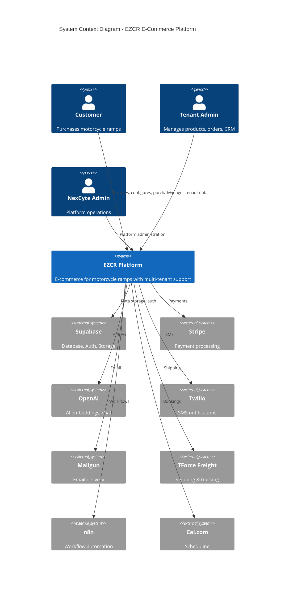
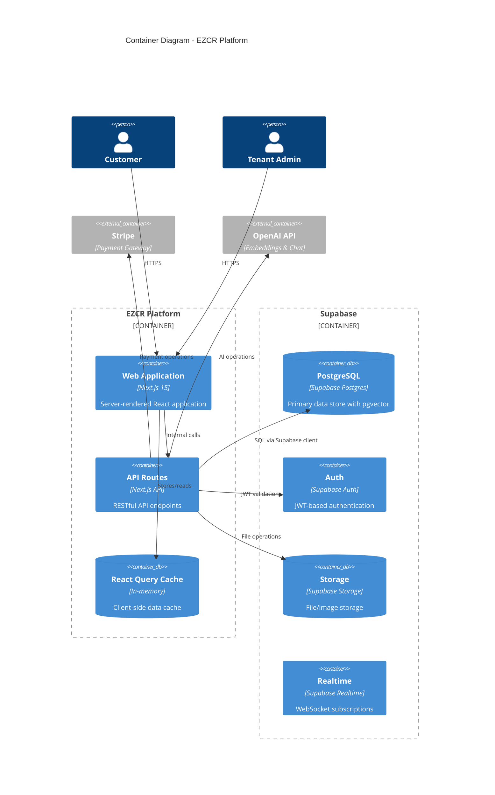
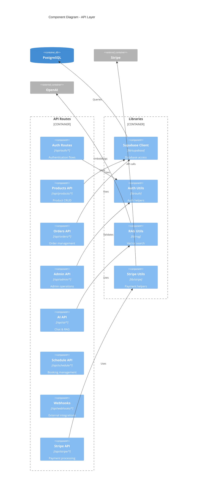
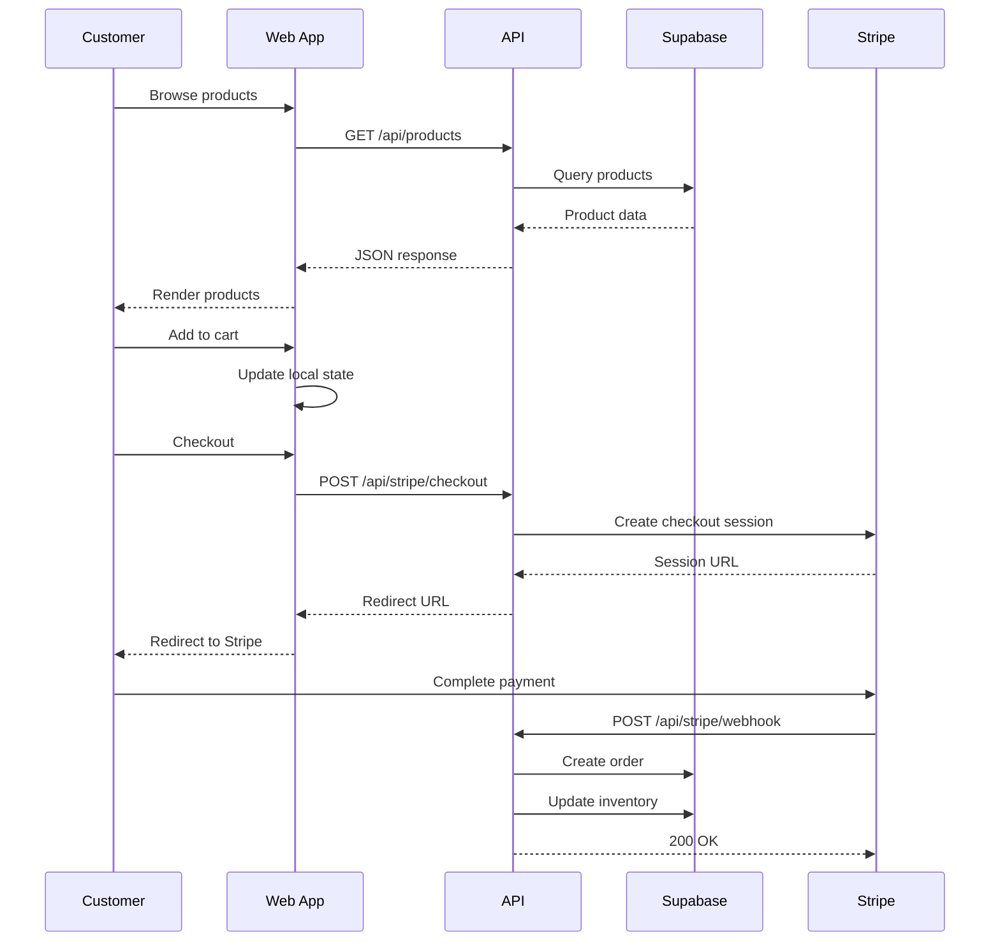
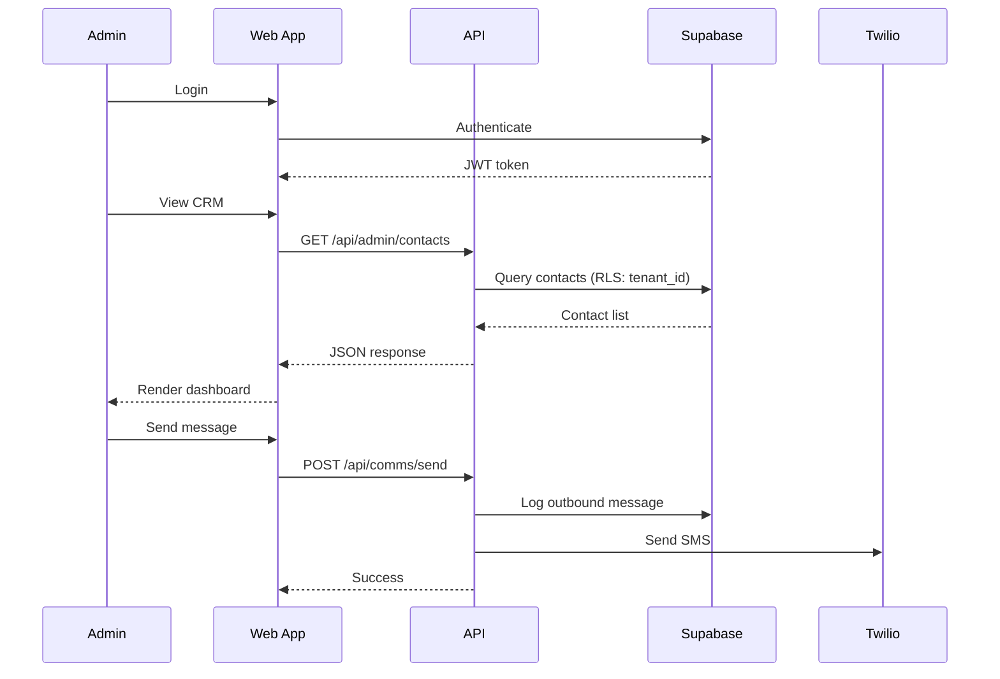
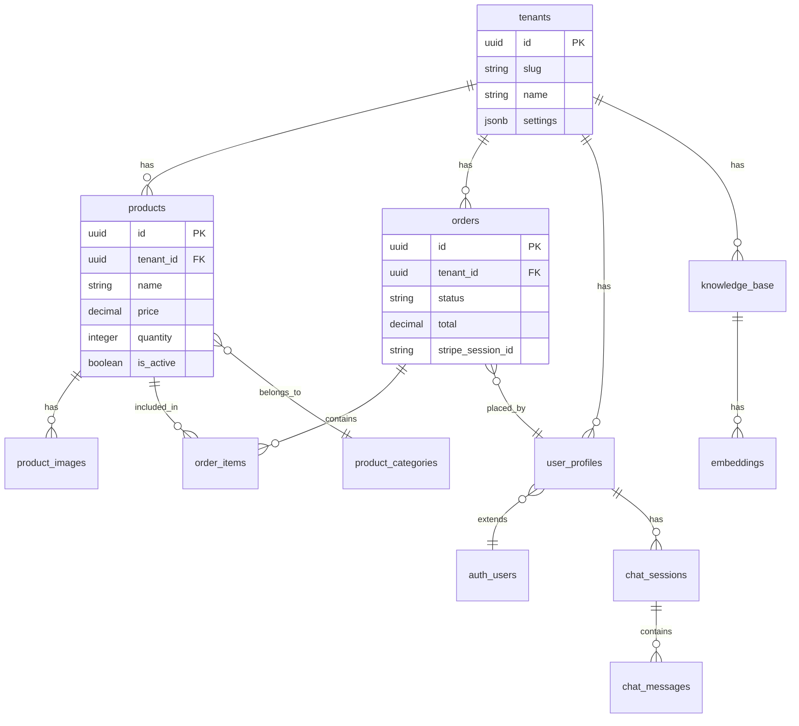
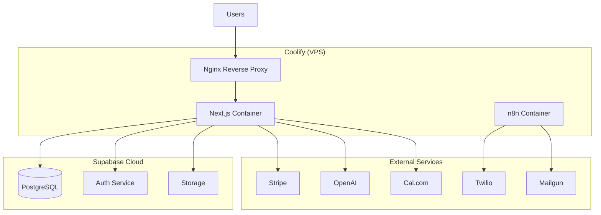

# EZCR Architecture (C4 Model)

**Date**: 2025-12-28
**Version**: 1.0

---

## Level 1: System Context Diagram



---

## Level 2: Container Diagram



---

## Level 3: Component Diagram



---

## Level 4: Code Patterns

### Authentication Flow

```typescript
// src/lib/auth/api-auth.ts
export async function requireAuth(request: Request): Promise<User> {
  const supabase = await createClient();
  const { data: { user }, error } = await supabase.auth.getUser();
  if (error || !user) throw new AuthError('Unauthorized');
  return user;
}

export async function requireRole(request: Request, role: string): Promise<User> {
  const user = await requireAuth(request);
  const profile = await getUserProfile(user.id);
  if (!has_role(profile, role)) throw new AuthError('Forbidden');
  return user;
}
```

### RAG Search Pattern

```typescript
// src/lib/rag/search.ts
export async function searchKnowledge(query: string, tenantId: string) {
  // 1. Generate embedding
  const embedding = await generateEmbedding(query);

  // 2. Vector similarity search
  const { data } = await supabase.rpc('search_knowledge_base', {
    query_embedding: embedding,
    search_tenant_id: tenantId,
    similarity_threshold: 0.7,
    max_results: 5
  });

  return data;
}
```

### Multi-Tenant Data Access

```typescript
// Pattern: Always filter by tenant_id
const { data } = await supabase
  .from('products')
  .select('*')
  .eq('tenant_id', tenantId)  // RLS also enforces this
  .eq('is_active', true);
```

---

## Data Flow Diagrams

### Customer Purchase Flow



### Admin CRM Flow



---

## Database Schema Overview



---

## Deployment Architecture



---

## Key Architectural Decisions

| Decision | Choice | Rationale |
|----------|--------|-----------|
| Framework | Next.js 15 App Router | SSR, API routes, React 19 |
| Database | Supabase (PostgreSQL) | Managed, RLS, pgvector |
| Auth | Supabase Auth | Integrated, JWT, RLS |
| Styling | Tailwind + shadcn/ui | Utility-first, accessible |
| State | React Query + Zustand | Server state + client state |
| Payments | Stripe | Industry standard |
| AI/RAG | OpenAI + pgvector | Proven, cost-effective |
| Hosting | Coolify (VPS) | Self-hosted, Docker |
